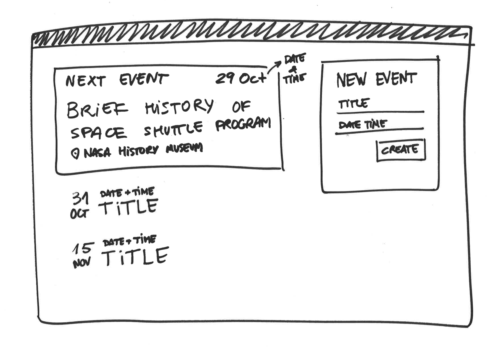

# Weekly assessment 6 (4 hours)

This is your final weekly assessment, it sums up many concepts you’ve learned in the junior part of the course, and it marks your passage to the senior part.

You have to create a full-stack calendar app. Make sure you commit often, following the [Semantic Comit Message](https://seesparkbox.com/foundry/semantic_commit_messages) convention.

### Back-End

In the `/server` folder create a [Koa](http://koajs.com/) REST server connected to a MongoDB database with [mongoose](http://mongoosejs.com/). It should offer the following API methods:

- `POST /events`

  Creates a new record in the database with the following parameters:

  - `title`: *String*. A descriptive title for the event.
  - `date`: *DateTime (ISO 8601).* Date and Time of the event.
  - `venue`: *String*. Where the event is taking place.

  All of these parameters are mandatory. In case any is missing the server should return a `400` HTTP status code.

  The request should return the correct HTTP status code in case of success.

- `GET /events`

  Returns a list of all events stored in the database, in JSON format. 

  ```json
  [
    {
      "id": "…",
      "title": "Brief history of Space Shuttle program",
      "date": "2016-10-29 19:00:00+01:00",
      "venue": "NASA History Museum"
    },
    {
      "id": "…",
      "title": "Why did the Challenger explode?",
      "date": "2016-11-31 18:30:00+01:00",
      "venue": "Albert II Library Building"
    }
  ]
  ```

### Front-End

In the `/client` folder create a React + Redux client that consumes the API offered by the back-end section. We encourage you to use [create-react-app](https://github.com/facebookincubator/create-react-app) and then adding Redux to it.

Put all the *Presentational Components* in the `components` folder and the *Container Components* in the `containers` folder.

Your app should allow the user to do the following:

- View a list of the upcoming events
- Add a new event

  When a new event is added, the event list should reflect the changes automatically and the form fields should be cleaned.



## Extra credit

- Add a loader (spinner, circular progress…) to the event list that is shown only when fetching.
- Display an error when the new event POST request returns an error.

